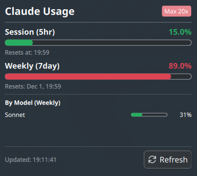

# Claude Usage Widget

A KDE Plasma 6 widget that displays your Claude Code usage statistics in the taskbar.


## Features

- **Real-time Usage Display**: Shows session (5hr) and weekly (7day) usage percentages
- **Color-coded Indicators**: Green (<50%), Yellow (<80%), Red (≥80%)
- **Detailed Popup**: Click to see full statistics
  
  - Session and weekly usage with progress bars
  - Reset times for both limits
  - Per-model breakdown (Sonnet/Opus)
  - Your subscription plan badge
- **Auto-refresh**: Updates every minute automatically
- **Error Handling**: Clear messages when not logged in or token expired
- **No Dependencies**: Pure QML, no Python or external tools required

## Requirements

- KDE Plasma 6.0 or later
- Claude Code CLI installed and logged in

## Installation

### From KDE Store

1. Right-click on your panel
2. Select "Add Widgets..."
3. Click "Get New Widgets..." > "Download New Plasma Widgets..."
4. Search for "Claude Usage"
5. Click Install

### Manual Installation

```bash
kpackagetool6 -t Plasma/Applet -i claude-usage-widget.plasmoid
```

### From Source

```bash
git clone https://github.com/anthropics/claude-usage-widget.git
cd claude-usage-widget
kpackagetool6 -t Plasma/Applet -i .
```

## Usage

1. Make sure you're logged in to Claude Code (run `claude` in terminal)
2. Add the widget to your panel
3. Click the widget to see detailed usage statistics

## How It Works

The widget reads your Claude Code OAuth credentials from `~/.claude/.credentials.json` and calls the Anthropic usage API directly. No data is stored or sent anywhere else.

### API Endpoint

```
GET https://api.anthropic.com/api/oauth/usage
Headers:
  Authorization: Bearer <oauth-token>
  anthropic-beta: oauth-2025-04-20
```

## Troubleshooting

### "Not logged in" error

Make sure you're logged in to Claude Code:
```bash
claude
```

### "Token expired" error

Your OAuth token has expired. Run Claude Code again to refresh it:
```bash
claude
```

### Widget shows 0%

- Click the refresh button in the popup
- Check logs: `journalctl --user -f | grep -i claude`

## File Structure

```
claude-usage-widget/
├── metadata.json           # Widget metadata
├── contents/
│   ├── ui/
│   │   └── main.qml        # Widget implementation
│   └── icons/
│       └── claude.svg      # Claude logo (orange)
└── screenshots/            # Preview images
```

## License

GPL-3.0-or-later

## Author

izll

## Version History

### 1.0.0 (2025)
- Initial release
- Session and weekly usage display
- Per-model breakdown (Sonnet/Opus)
- Auto-refresh every minute
- Error handling for login issues
